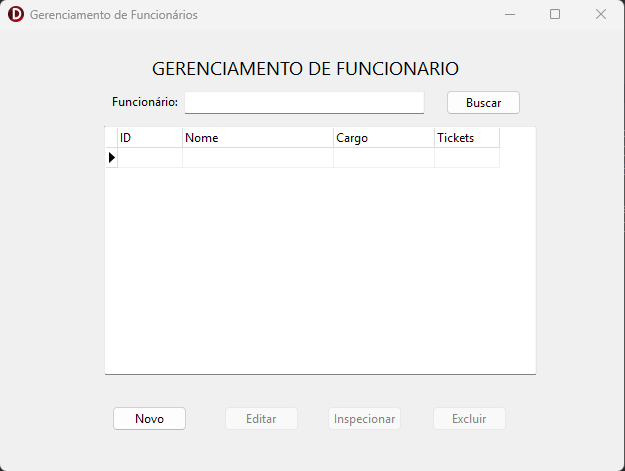

# Sistema de Gerenciamento de Tickets - Delphi

Este projeto é um sistema simples de cadastro de funcionários e controle de tickets, desenvolvido em **Delphi 12** utilizando **SQLite** como banco de dados.



## 🚀 Funcionalidades

- **Funcionários**: Cadastro completo, Edição inteligente, Exclusão em cascata e Inspeção.
- **Tickets**: Cadastro vinculado, Atualização automática de saldo e Filtros de busca.
- **Banco de Dados**: SQLite com persistência e integridade referencial.

## 🛠️ Tecnologias Utilizadas

- **Linguagem**: Delphi (Object Pascal)
- **Banco de Dados**: SQLite (FireDAC)
- **Automação**: Script Python para migração de banco.

## ⚠️ Pré-requisitos (IMPORTANTE)

Para que o sistema funcione, é **obrigatório** gerar o arquivo do banco de dados antes da primeira execução:

1. Tenha o **Python 3** instalado em sua máquina.
2. No terminal, na raiz do projeto, execute:
   ```bash
   python create_db.py
   ```
3. O script criará o arquivo `banco_dados.db`. 
4. **Mova ou copie** o arquivo `banco_dados.db` para a pasta do executável (ex: `Win32/Debug/`) para que o Delphi o localize.

## 📦 Como Compilar - passo a passo

1. Clone o projeto em sua máquina por meio do seguinte comando:
``` bash
git clone https://github.com/AspetereCoder/App-Ticket-Delphi.git
```
2. Abra a pasta do projeto
3. Rode o script `create_db.py` conforme já dito anteriormente.
4. Abra o arquivo `AppTicket.dproj` no RAD Studio.
5. Certifique-se de que o arquivo `.db` gerado está na pasta correta do binário.
6. Pressione `F9` para compilar e rodar.

## 📄 Estrutura do Banco

- **funcionario**: id, nome, cpf, cargo, genero, dataCriacao, qtdTickets.
- **ticket**: id, funcionarioId, qtd, dataCriacao.
